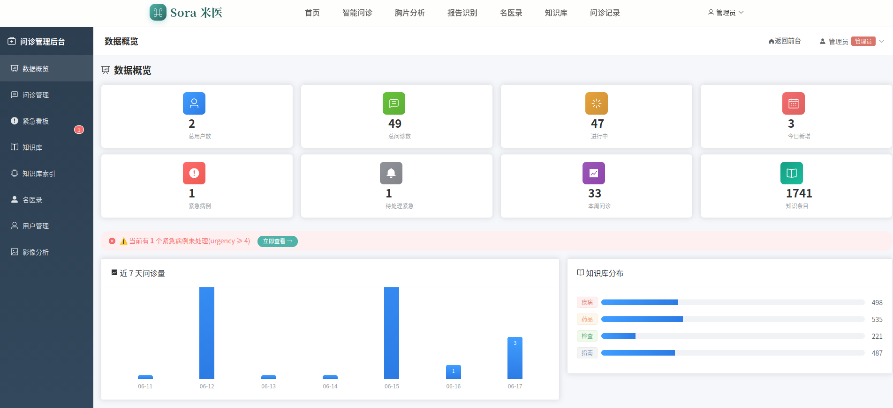
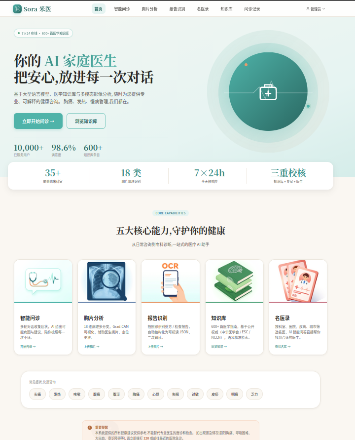
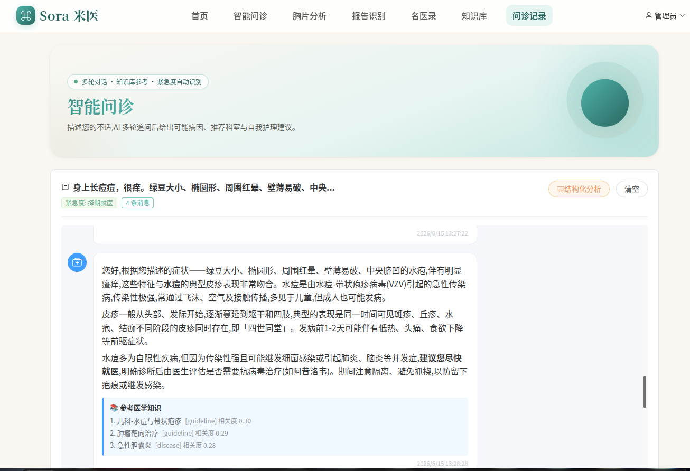
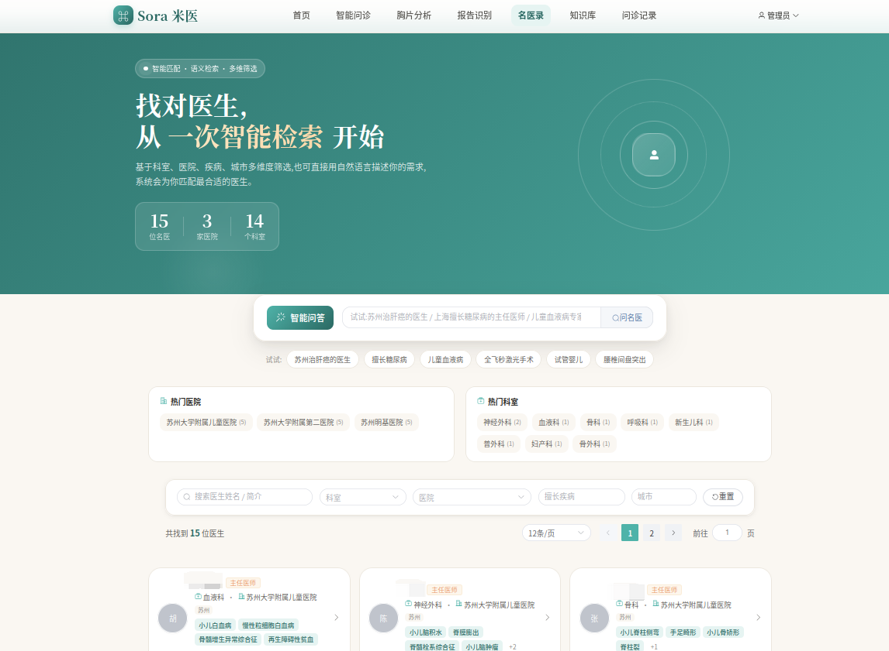
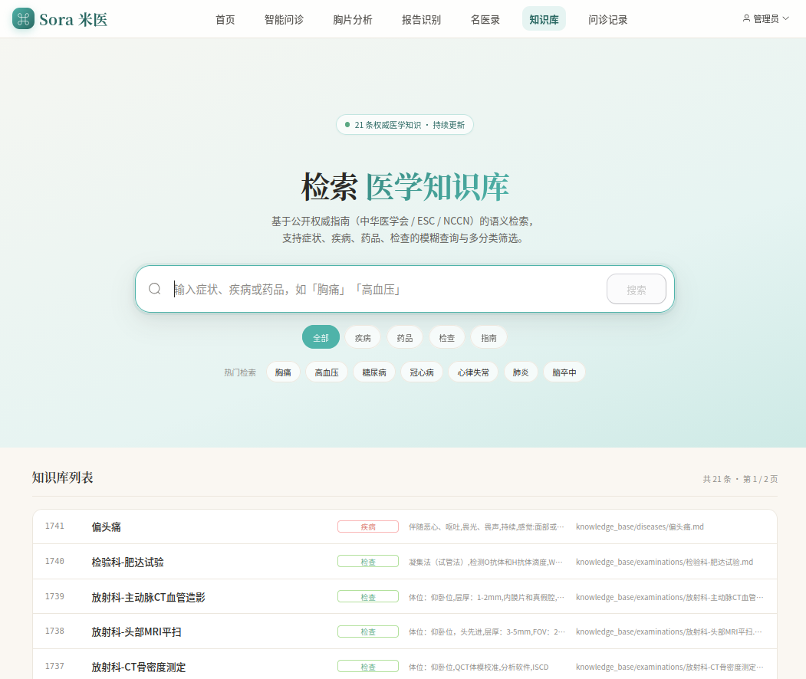
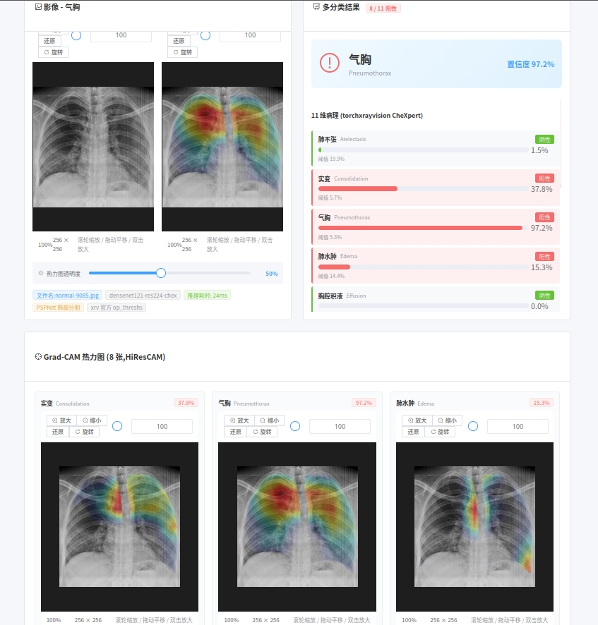

# AI 智能问诊系统(Sora 米医)

> 基于 **LLM + Agent + RAG + 医学影像 + OCR + 名医录** 的多模态医疗 AI 工作台,提供智能症状分析、知识检索、智能分诊、多轮对话、胸片分析、处方/报告识别、名医检索,并配备完整的管理后台与医生人工回复能力。


---

## 一句话定位

一个把 **LLM 对话 + 知识库 RAG + 胸片 X-ray 分类 + 处方/报告 OCR + 名医录 + 医生人工接管** 六个能力塞进同一个 FastAPI + Vue 3 系统的多模态医疗 AI 工作台。Agent 内部用 **LangGraph StateGraph** 编排,后台支持**异步重建向量索引**(不阻塞主请求)。

---

## ✨ 核心能力(七模块)

### 🤖 1. LLM 对话问诊(患者端)
| 模块 | 说明 |
|---|---|
| 💬 **多轮对话** | 持续收集症状,主动追问(持续时间/伴随/既往史/用药) |
| 🧠 **结构化分析** | 一键输出 JSON 报告(紧急度/可能病因/检查/科室/护理),自动写回问诊 |
| 🏥 **智能分诊** | 根据症状推荐就诊科室 + 紧急度等级 |
| 📚 **RAG 检索** | 基于 FAISS 向量库 + 关键词加权的医学知识精准检索 |
| 🚨 **紧急识别** | 胸痛、呼吸困难、剧烈头痛等触发立即就医提示 |
| 💾 **问诊记录** | 持久化存储,支持回溯查看 |

### 🩻 2. 胸片 X-ray 影像分析(医生端)
| 模块 | 说明 |
|---|---|
| 🔬 **18 病理多分类** | 基于 torchxrayvision DenseNet121(`densenet121-res224-chex`),覆盖肺炎/气胸/胸腔积液/肺水肿/心影增大等 |
| 🎯 **Grad-CAM 热力图** | HiResCAM,可选 PSPNet 双肺分割限定(避免胸外信号干扰) |
| 📝 **医生标注** | 对 AI 判断给「同意/反对」+ 修正标签,反哺质量评估 |
| 🗂 **历史回溯** | 医生按患者/医生维度筛选,管理员看全平台 |

> 在线服务**仅**走 xrv DenseNet121;`backend/scripts/train_pneumonia.py` 训练的自训练 ResNet50 目前为离线脚本,未接入在线推理。

### 📄 3. 处方/报告 OCR(患者端,登录可选)
| 模块 | 说明 |
|---|---|
| 🖼 **多引擎** | `tesseract`(本地)/ `vision`(多模态 LLM 读图)/ `mock`(演示),`OCR_ENGINE=auto` 按可用性自动选 |
| 🏥 **处方识别** | 提取患者/医院/科室/医生/诊断/药品清单(剂量/频次/给药途径/疗程)/医嘱 |
| 📊 **检验报告识别** | 提取项目/结果/单位/参考范围/异常标记,LLM 二次解读生成 summary |
| 💾 **识别记录** | 持久化保留原图 + OCR 文本 + 结构化数据 + 置信度 |

### 👨‍⚕️ 4. 医生人工回复 & 接管
| 模块 | 说明 |
|---|---|
| 📋 **问诊详情** | 医生看完整患者资料 + 对话流 + AI 评估 |
| ✍️ **专业回复** | 对 AI 答案进行专业修正,可覆盖紧急度 / 补充诊断 |
| 🔒 **自动结束** | 医生回复后问诊自动标 `closed`,患者端可见 |

### 🏥 5. 名医录(患者端 + 管理端)
| 模块 | 说明 |
|---|---|
| 🔍 **患者检索** | 首页 `/doctors` 列表 + 详情,按科室 / 城市 / 专长筛选 |
| 🧠 **RAG 一体化** | 医生档案(姓名 / 科室 / 医院 / 专长 / 简介 / 出诊信息)一并入向量库,与知识库 / 药品统一检索 |
| 🛠 **管理端 CRUD** | `/admin/doctors` 增删改查 + 批量导入;新增/编辑**不自动 reindex**,需手动触发 |
| 🔗 **ID 规范** | 检索结果 `id` 三种前缀:`kb_6`(知识库)/ `dr_5`(医生)/ `file_xxx.md`(本地 .md),前端无需特殊处理 |

### 🛡️ 6. 管理后台(`/admin`)
| 模块 | 说明 |
|---|---|
| 📊 **数据概览** | 8 张指标卡(用户/问诊/今日/本周/紧急) + 近 7 日趋势 + 知识库分类分布 |
| 📋 **问诊管理** | 全平台问诊,可按紧急度/状态/关键词/患者筛选 |
| 🚨 **紧急看板** | 重点高亮 `urgency ≥ 4` 的活跃问诊,一键跳转 |
| 👥 **用户管理** | 改角色(管理员/医生/普通用户)、设科室、封禁/解封 |
| 📚 **知识库管理** | 增删改查,**不自动 reindex**(由 `知识库索引` 页显式触发) |
| 🔍 **知识库索引** | 单独页面 `/admin/knowledge-index` 看索引元信息(签名/大小/条目数)+ 一键异步重建 + 实时进度条 |
| 🏥 **名医录管理** | `/admin/doctors` 增删改查,医生档案一并入 RAG 索引 |
| 🩻 **影像分析管理** | 全平台胸片分析记录(复用 `/imaging/history` 页) |

### ⚙️ 7. 基础设施
| 模块 | 说明 |
|---|---|
| 🔌 **WebSocket 流式对话** | `/api/ws/chat` 实时双向,支持携带 `image_path` 进行图文多模态对话 |
| 🛂 **JWT 鉴权** | 角色分层:用户 / 医生 / 管理员,doctor 或 admin 才可回复 |
| 💾 **存储** | SQLite(默认)/ PostgreSQL(可选) + Redis(可选) |
| 🐳 **Docker** | 一键 `docker-compose up`,含 Postgres + Redis + 后端 + 前端 |
| 🧠 **LangGraph 编排** | MedicalAgent 重构为 StateGraph(analyze / chat / triage 三个图),节点可独立替换 |
| ⚡ **异步重建索引** | `POST /admin/reindex` 立即返回,后台 worker 协程跑向量化;前端轮询 `/admin/reindex/status` 看进度 |

---

## 🛠️ 技术栈

**后端**
- FastAPI 0.109 + SQLAlchemy 2.0(async) + aiosqlite/asyncpg
- **LangGraph StateGraph** 编排 MedicalAgent(`backend/app/agents/{graph,nodes,state,tools,langchain_llm}.py`)
- FAISS-cpu 向量检索 + 关键词加权
- **torchxrayvision 1.4** 胸片多分类(在线唯一推理引擎)
- OpenCV + Pillow 影像预处理 + **PSPNet 肺部分割**(用于影像入参校验)

**AI 模型**
- LLM:`mock`(规则引擎) / `ollama`(归一为 OpenAI 协议,自动注入 `think=False`) / `openai`(兼容通义/智谱/DeepSeek/OpenAI)
- Embedding:`mock`(字符 n-gram 哈希,零依赖) / `local`(sentence-transformers) / `openai`(text-embedding-3-small),可独立配置 `EMBEDDING_BASE_URL`(与 LLM 分离,避免走收费 API)
- OCR:`tesseract` / `vision`(多模态 LLM) / `mock`
- 影像:`densenet121-res224-chex`(xrv,在线) + `pneumonia_resnet50.pth`(自训练,离线)

**前端**
- Vue 3.4 + Composition API + Pinia + Vue Router 4
- Element Plus 2.5 + Axios + Marked
- Vite 构建,nginx 托管

---

## 📁 项目结构

```
AI智能问诊系统/
├── backend/                                      # FastAPI 后端
│   ├── main.py                                   # 应用入口 + lifespan
│   ├── requirements.txt
│   ├── .env.example
│   ├── Dockerfile
│   ├── scripts/                                  # 训练脚本(离线)
│   │   ├── train_pneumonia.py                    # 自训练 ResNet50 肺炎二分类(离线)
│   │   └── train hospital_model.py               # 占位
│   └── app/
│       ├── core/                                 # config / database / security / lifespan
│       ├── models/                               # ORM: User / Consultation / Message /
│       │                                         #       Knowledge / OcrRecord /
│       │                                         #       ImagingAnalysis / DoctorAnnotation /
│       │                                         #       Doctor(名医录)
│       ├── schemas/                              # Pydantic: user / consult / knowledge /
│       │                                         #          agent / ocr / doctor
│       ├── services/
│       │   ├── llm_service.py                    # OpenAI 兼容 + Mock + Ollama 归一 +
│       │   │                                       #   thinking-disable 注入
│       │   ├── embedding.py                      # 三种 provider + AsyncOpenAI 生命周期管理
│       │   ├── rag_service.py                    # FAISS + 关键词加权 + 异步 reindex worker
│       │   ├── ocr_service.py                    # tesseract / vision / mock
│       │   └── imaging/
│       │       ├── base.py                       # 抽象接口
│       │       ├── xrv_service.py                # DenseNet121 + PSPNet + Grad-CAM
│       │       └── validation.py                 # 胸片真伪校验(PSPNet 肺野占比)
│       ├── agents/
│       │   ├── medical_agent.py                  # 对外 API(向后兼容)
│       │   ├── graph.py / nodes.py / state.py    # LangGraph StateGraph 编排
│       │   ├── tools.py / langchain_llm.py       # 节点工具 + ChatOpenAI 适配
│       ├── api/
│       │   ├── v1/
│       │   │   ├── user.py                       # 注册/登录/资料
│       │   │   ├── consult.py                    # 问诊 CRUD + 消息
│       │   │   ├── agent.py                      # 结构化分析/分诊
│       │   │   ├── knowledge.py                  # 知识库公开 CRUD
│       │   │   ├── ocr.py                        # 上传/记录/删除
│       │   │   ├── imaging.py                    # 胸片分析/历史/标注
│       │   │   └── admin.py                      # 后台:仪表盘/问诊/紧急/用户/知识/医生回复
│       │   └── ws/chat.py                        # WebSocket 流式对话
│       └── utils/logger.py
│
├── frontend/                                     # Vue 3 前端
│   ├── package.json                              # 依赖:vue 3.4 / element-plus 2.5 / pinia / marked
│   ├── vite.config.js
│   ├── Dockerfile + nginx.conf
│   └── src/
│       ├── api/                                  # http / user / consult / agent / knowledge /
│       │                                         #     admin / ocr / imaging
│       ├── stores/                               # Pinia: user / chat
│       ├── router/index.js                       # 含 /admin 路由守卫 + /ocr + /imaging
│       ├── components/                           # GradCAM.vue / ImageViewer.vue
│       ├── views/
│       │   ├── Home.vue / Chat.vue / History.vue / Knowledge.vue / Login.vue
│       │   ├── ocr/OCR.vue
│       │   ├── Imaging/Analysis.vue / History.vue
│       │   └── admin/                            # 后台 6 个页面
│       │       ├── AdminLayout.vue
│       │       ├── Dashboard.vue / Consultations.vue / Emergency.vue
│       │       ├── KnowledgeAdmin.vue / Users.vue
│       └── styles/
│
├── knowledge_base/                               # 医学知识库(共 119 篇 + 2 张表)
│   ├── diseases/         18 篇                   # 感冒/胃肠炎/高血压/偏头痛/冠心病/糖尿病/...
│   ├── drugs/            83 篇                   # 对乙酰氨基酚/布洛芬/二甲双胍/...
│   ├── examinations/      8 篇                   # 血常规/心电图/...
│   ├── guidelines/       10 篇                   # 感冒用药/胸痛识别/急救电话/...
│   ├── 医保常用药品列表.md
│   └── 医保药品速查表.md
│
├── scripts/
│   ├── init_kb.py                                # Markdown → SQLite + FAISS
│   ├── start.sh                                  # 一键启动(venv + .env + init + uvicorn + vite)
│   └── stop.sh
│
├── docs/
│   └── AI影像分析模块方案.md                      # 影像子模块设计文档
│
├── mobile/                                       # uni-app 移动端(Android / iOS / H5)
│   ├── README.md                                 # 移动端说明 + Docker 离线打包指引
│   ├── BUILD.md                                  # 详细打包步骤
│   ├── src/                                      # 4 个 tab(首页/问诊/发现/我的)
│   └── scripts/                                  # Docker 链路打包脚本
│
├── data/                                         # 运行时数据(不入 git,见 .gitignore)
│   ├── medical.db                                # SQLite
│   ├── faiss_index/                              # 向量索引
│   ├── chest_xray/                               # 胸片上传临时
│   └── ocr_uploads/                              # OCR 上传临时
│
├── docker-compose.yml                            # postgres + redis + backend + frontend
├── .env.example
├── HOSPITAL_MODEL_TRAINING.md                    # 医院专属模型训练指南
├── IMAGING_COMPARISON.md                         # 影像双路推理对比
├── PROJECT_ANALYSIS.md                           # 深度项目分析
└── README.md                                     # 本文件
```

---

## 🚀 快速开始

### 默认账号(数据库为空时)

| 账号 | 密码 | 角色 | 入口 |
|---|---|---|---|
| `admin` | `admin123` | 超级管理员 | http://localhost:5173/admin |
| `dr_zhang` | `doctor123` | 医生(心血管内科) | 可在后台回复问诊、做影像分析 |

> 首次启动数据库是空的,需运行「创建管理员/医生」inline 脚本(见下)。

### 方式一:一键脚本(Mac/Linux)

```bash
cd /home/evynlau/桌面/AI-Agent/AI智能问诊系统
./scripts/start.sh
```

脚本自动:
1. 创建 Python venv + 安装依赖
2. 创建 `.env`(默认 `mock` LLM,无需 Key)
3. 跑 `scripts/init_kb.py`,把 119 篇知识入库 + 构建 FAISS
4. 启动后端 `http://localhost:8000`
5. 启动前端 `http://localhost:5173`

### 方式二:Docker Compose(带 Postgres + Redis)

```bash
cd /home/evynlau/桌面/AI-Agent/AI智能问诊系统
cp .env.example .env
# 编辑 .env:填 LLM / Key(可选)
docker-compose up -d
```

镜像构建时会自动跑 `init_kb.py`。

### 方式三:手动启动

```bash
# 后端
cd backend
python -m venv venv && source venv/bin/activate
pip install -r requirements.txt
cp .env.example .env
python ../scripts/init_kb.py
uvicorn main:app --reload --port 8000

# 前端(新终端)
cd frontend
npm install
npm run dev
```

---

## ⚙️ 配置说明(`backend/.env`)

### LLM 三种模式

| `LLM_PROVIDER` | 说明 | 适用 |
|---|---|---|
| `mock` | 内置规则引擎 + 模板,无需任何服务 | 先跑通流程、调试 |
| `ollama` | 本地 Ollama,内部归一为 OpenAI 协议(`base_url=http://localhost:11434/v1`) | 本地推理、隐私 |
| `openai` | OpenAI 兼容服务(支持 GPT-4 / 通义 / 智谱 / DeepSeek) | 云端 API |

**Ollama 配置示例**:
```bash
LLM_PROVIDER=ollama
OPENAI_API_KEY=ollama                  # Ollama 不校验 key
OPENAI_BASE_URL=http://localhost:11434/v1
OPENAI_MODEL=<你本地已下载的模型>     # 任意 OpenAI 兼容 chat 模型名
```

**OpenAI 兼容云服务**:

| 服务 | BASE_URL | 推荐模型 |
|---|---|---|
| OpenAI | `https://api.openai.com/v1` | `gpt-4-turbo-preview`(配置默认值) |
| 通义千问 | `https://dashscope.aliyuncs.com/compatible-mode/v1` | `qwen-plus` / `qwen-max` |
| 智谱 GLM | `https://open.bigmodel.cn/api/paas/v4` | `glm-4-plus` / `glm-4-flash` |
| DeepSeek | `https://api.deepseek.com/v1` | `deepseek-chat` |

> ⚠️ **避免思考型 MoE 模型**:部分模型只把答案写在 `reasoning` 字段,`content` 为空。本系统已自动检测并从 `reasoning` 提取,但**强烈推荐用非思考型**(如 `qwen-plus`、`glm-4-flash`、本地非思考模型)。`llm_service._clean_reply()` 也会剥掉模型常见的"自检/草稿"残留段。

### Embedding 三种模式

| `EMBEDDING_PROVIDER` | 原理 | 依赖 |
|---|---|---|
| `mock`(默认) | 字符 n-gram 哈希,确定性伪向量 | 零依赖,推荐本地演示 |
| `local` | sentence-transformers(默认 `paraphrase-multilingual-MiniLM-L12-v2`) | 首次下载 ~120MB |
| `openai` | `text-embedding-3-small` | API Key |

`EMBEDDING_BASE_URL` / `EMBEDDING_API_KEY` 可**与 LLM 独立**(留空回退到 `OPENAI_BASE_URL`)。
典型场景:LLM 走 OpenAI 收费,embedding 走本地 Ollama 的 `nomic-embed-text`(免费、中英双语、768 维):

```bash
EMBEDDING_PROVIDER=openai
EMBEDDING_BASE_URL=http://localhost:11434/v1
EMBEDDING_API_KEY=ollama
# EMBEDDING_MODEL 留空时,llm_service 会按 base_url 自动选:
#   - 含 11434 → nomic-embed-text
#   - 其他     → text-embedding-3-small
```

> `mock` 语义能力弱,**只用于跑通流程**;生产请换 `local` 或 `openai`。

### OCR 配置

| `OCR_ENGINE` | 引擎 | 依赖 |
|---|---|---|
| `auto`(默认) | 自动按可用性:`vision` > `tesseract` > `mock` | — |
| `tesseract` | 本地 tesseract-ocr | 系统包 `tesseract-ocr`(中文需 `tesseract-ocr-chi-sim`) |
| `vision` | 多模态 LLM 直接读图 | 需要 `OPENAI_BASE_URL` + 视觉模型(如 `gpt-4-vision-preview` / `llama3.2-vision`) |
| `mock` | 演示文本(便于调试) | 无 |

OCR 视觉模型用 `OCR_VISION_MODEL` 单独指定,留空跟随 `OPENAI_MODEL`。

### 影像分析配置

| 变量 | 默认值 | 说明 |
|---|---|---|
| `PNEUMONIA_MODEL_PATH` | `./checkpoints/pneumonia_resnet50.pth` | 自训练权重路径(当前**未接入**在线服务) |
| `IMAGING_MAX_FILE_SIZE_MB` | 10 | 胸片上传上限 |
| `IMAGING_VALIDATION` | `auto` | 入参真伪校验:`auto` / `true` / `false`;基于 PSPNet 肺部分割,**完全本地、不调 LLM**;真胸片肺野占比通常 8-25%,低于 0.5% 直接 422 拒绝 |

xrv DenseNet121 权重在首次推理时自动从官方下载到 `~/.torchxrayvision/models_data/`。

### 创建管理员/医生账号

启动后,在 `backend/` 目录下运行:

```python
python3 << 'PYEOF'
import asyncio, sys, bcrypt
sys.path.insert(0, '.')
from app.core.database import AsyncSessionLocal
from app.models.user import User
from sqlalchemy import select

async def main():
    async with AsyncSessionLocal() as db:
        # 管理员
        a = (await db.execute(select(User).where(User.username == "admin"))).scalar_one_or_none()
        if not a:
            pw = "admin123"
            db.add(User(username="admin", email="admin@medical.com",
                hashed_password=bcrypt.hashpw(pw.encode()[:72], bcrypt.gensalt()).decode(),
                full_name="系统管理员", is_admin=True, is_active=True))
            print(f"✅ 创建 admin / {pw}")
        # 医生
        z = (await db.execute(select(User).where(User.username == "dr_zhang"))).scalar_one_or_none()
        if not z:
            pw = "doctor123"
            db.add(User(username="dr_zhang", email="zhang@hospital.com",
                hashed_password=bcrypt.hashpw(pw.encode()[:72], bcrypt.gensalt()).decode(),
                full_name="张医生", is_doctor=True, specialty="心血管内科", is_active=True))
            print(f"✅ 创建医生 dr_zhang / {pw}")
        await db.commit()
asyncio.run(main())
PYEOF
```

---

## 🎬 三种角色完整工作流

### 👤 患者流程

```
1. 访问 http://localhost:5173 → 首页
2. 点 "立即开始问诊" / 选 "常见症状" → Chat.vue
3. 描述症状(可匿名)→ AI 多轮追问(支持携带 image_path 图文对话)
4. 答完后点 "结构化分析" → 弹出报告
   同时自动同步到问诊(紧急度/科室/分析消息)
5. 右上角 "问诊记录" → History.vue
6. 额外能力:
   导航 → "OCR 识别" 上传处方/报告(可选登录)
   导航 → "名医录" 按科室/城市检索医生(RAG 一体化)
```

### 👨‍⚕️ 医生流程(在管理后台)

```
文字问诊:
1. 访问 http://localhost:5173/admin
2. 用 dr_zhang / doctor123 登录
3. 左侧菜单 → "问诊管理" → 看所有患者问诊
4. 点某条 → 详情(患者信息 + 完整对话 + AI 评估)
5. "医生回复" 表单填诊断/覆盖紧急度/写专业回复
6. 提交后问诊自动 closed,患者端看到医生消息

胸片分析:
1. 访问 /imaging(或后台 /admin/imaging)
2. 上传胸片(JPEG/PNG, ≤10MB)→ AI 返回 18 病理多分类 + Grad-CAM
3. 在详情页写 "医生标注"(同意/反对 + 修正标签)
4. 历史 → /imaging/history 按患者/医生筛选
```

### 🛡️ 管理员流程

```
1. 访问 http://localhost:5173/admin
2. 用 admin / admin123 登录
3. "数据概览" → 8 张指标卡 + 趋势图 + 知识库分布
4. "紧急看板" → urgency≥4 的活跃问诊
5. "问诊管理" → 全平台筛选(紧急度/状态/关键词)
6. "知识库管理" → 增删改查(**不自动 reindex**,去下一步触发)
7. "知识库索引" → 看索引元信息(签名/大小) + 一键异步重建 + 实时进度
   或 医生在 "名医录管理" 增删改后,也在此触发重建
8. "用户管理" → 改角色(管理员/医生)、设科室、封禁
9. "影像分析管理" → 看全平台胸片分析记录
```

---

## 📚 知识库管理

### 内置 119 篇 + 2 张表

| 分类 | 数量 | 目录 |
|---|---|---|
| 疾病 | 18 | `knowledge_base/diseases/` |
| 药品 | 83 | `knowledge_base/drugs/` |
| 检查 | 8 | `knowledge_base/examinations/` |
| 指南 | 10 | `knowledge_base/guidelines/` |
| 医保表 | 2 | `knowledge_base/*.md` 根目录 |

### 添加新知识(三种方式)

**方式 1:Markdown 文件**
1. 在 `knowledge_base/<类别>/` 创建 `.md`
2. 第一个 `#` 标题作为知识标题
3. 重启或手动 init:
   ```bash
   cd backend && source venv/bin/activate
   python ../scripts/init_kb.py
   ```

**方式 2:API(管理员)**

```bash
curl -X POST http://localhost:8000/api/v1/admin/knowledge \
  -H "Authorization: Bearer <admin_token>" \
  -H "Content-Type: application/json" \
  -d '{"title":"...","category":"disease","content":"...","tags":"...","source":"..."}'
```

**方式 3:管理后台 UI** → 知识库管理 → 新增知识 → 填表 → 保存(**不自动 reindex**,去 `知识库索引` 页显式触发)

### 重建索引(**异步、不阻塞**)

后台从 v0.6 起改为**异步重建**:

- 调用 `POST /api/v1/admin/reindex` 立即返回 `200`(实际向量化在后台 worker 协程里跑)
- 前端用 `GET /api/v1/admin/reindex/status` 轮询进度:`idle / queued / running / finished / error`
- 启动时**不再向量化**:lifespan 只读磁盘索引(典型 < 100ms),空索引时搜索返回空,直到管理员手动重建
- 索引带 SHA-256 文档签名,内容未变时跳过重建(管理端元信息可见 `signature`)
- 同一时刻只跑一个 reindex,并发请求会被合并(队列容量=1)

```bash
# 触发(立即返回)
curl -X POST http://localhost:8000/api/v1/admin/reindex \
  -H "Authorization: Bearer <admin_token>"

# 查状态
curl -X GET http://localhost:8000/api/v1/admin/reindex/status \
  -H "Authorization: Bearer <admin_token>"
# {"status":"running","progress":{"current":120,"total":521,"started_at":"..."}}

# 看索引元信息(签名/大小/条目数)
curl -X GET http://localhost:8000/api/v1/admin/reindex/info \
  -H "Authorization: Bearer <admin_token>"
```

> 旧路径 `POST /api/v1/admin/knowledge/reindex` 仍兼容,等价于上面。

---

## 🔌 API 速览

完整 OpenAPI 文档: **http://localhost:8000/docs**

### 路由总览

| 前缀 | 模块 | 鉴权 |
|---|---|---|
| `/api/v1/user` | 注册/登录/资料 | 部分需登录 |
| `/api/v1/consult` | 问诊 CRUD + 消息 | 部分需登录(支持匿名) |
| `/api/v1/agent` | 结构化分析 / 快速分诊 | 公开 |
| `/api/v1/knowledge` | 知识库 CRUD + 检索 | 公开(支持 `kb_32` 形式 ID) |
| `/api/v1/doctor` | 名医录公开检索 | 公开 |
| `/api/v1/ocr` | 处方/报告 OCR 上传与记录 | 部分需登录 |
| `/api/v1/imaging` | 胸片分析 / 历史 / 标注 / 模型列表 | 登录即可(医生 / 管理员拥有 PSPNet 校验) |
| `/api/v1/admin` | 后台:仪表盘/问诊/紧急/用户/知识/医生回复/医生/索引管理 | 管理员(部分医生可回复) |
| `/api/ws/chat` | WebSocket 流式对话(支持 `image_path` 图文) | 公开 |
| `/health` `/` | 健康检查 / 根信息 | 公开 |

### 患者端 / 公开 API

| Method | Path | 鉴权 | 说明 |
|---|---|---|---|
| POST | `/api/v1/user/register` | ❌ | 注册(自动返回 token) |
| POST | `/api/v1/user/login` | ❌ | 登录 |
| GET | `/api/v1/user/me` | ✅ | 我的资料 |
| PUT | `/api/v1/user/me` | ✅ | 修改资料 |
| POST | `/api/v1/consult` | ❌ | 创建问诊(可匿名) |
| GET | `/api/v1/consult` | ✅ | 我的问诊列表 |
| GET | `/api/v1/consult/{id}` | 可选 | 问诊详情(本人或匿名 id) |
| POST | `/api/v1/consult/{id}/messages` | 可选 | 发送消息(非流式) |
| POST | `/api/v1/consult/{id}/close` | 可选 | 结束问诊 |
| POST | `/api/v1/agent/analyze` | ❌ | 结构化分析(`consultation_id` 可选,传则自动同步) |
| POST | `/api/v1/agent/triage` | ❌ | 快速分诊 |
| GET | `/api/v1/knowledge` | ❌ | 知识库列表(`category` / `keyword` / 分页) |
| GET | `/api/v1/knowledge/{id}` | ❌ | 知识详情 |
| POST | `/api/v1/knowledge` | ❌ | 公开新增(不推荐,推荐管理后台) |
| DELETE | `/api/v1/knowledge/{id}` | ❌ | 公开删除(同上) |
| POST | `/api/v1/knowledge/reindex` | ❌ | 重建索引 |
| GET | `/api/v1/knowledge/search/query?q=` | ❌ | 语义检索 |
| POST | `/api/v1/ocr/upload` | 可选 | 上传图片 + OCR + LLM 结构化 |
| GET | `/api/v1/ocr/records` | ✅ | 我的 OCR 记录 |
| GET | `/api/v1/ocr/records/{id}` | ✅ | 记录详情 |
| DELETE | `/api/v1/ocr/records/{id}` | ✅ | 删除记录(含原图) |
| WS | `/api/ws/chat` | ❌ | 实时流式对话 |

### 影像分析(医生)

| Method | Path | 鉴权 | 说明 |
|---|---|---|---|
| POST | `/api/v1/imaging/pneumonia/analyze` | 医生 | 上传胸片 + 18 病理多分类 + Grad-CAM |
| GET | `/api/v1/imaging/history` | 登录 | 分析历史(`patient_id` / `doctor_id` 筛选) |
| GET | `/api/v1/imaging/{id}` | 本人或管理员 | 详情 |
| POST | `/api/v1/imaging/{id}/annotate` | 医生 | 医生标注(同意/反对 + 修正) |
| GET | `/api/v1/imaging/{id}/annotations` | 登录 | 标注列表 |
| GET | `/api/v1/imaging/models/list` | 管理员 | 可用模型清单 |

### 管理后台(管理员;`*` 标为医生也可)

| Method | Path | 说明 |
|---|---|---|
| GET | `/api/v1/admin/stats` | 仪表盘统计(总数/今日/本周/紧急/趋势/知识分布) |
| GET | `/api/v1/admin/consultations` | 全平台问诊列表(`status` / `urgency` / `keyword` / `user_id` 筛选) |
| GET | `/api/v1/admin/consultations/{id}` | 问诊详情(含患者信息) |
| POST | `/api/v1/admin/consultations/{id}/reply` | **医生回复***(问诊自动 closed) |
| GET | `/api/v1/admin/emergency` | 紧急病例(urgency≥4) |
| GET | `/api/v1/admin/users` | 用户列表 |
| PUT | `/api/v1/admin/users/{id}` | 修改用户角色/状态 |
| POST | `/api/v1/admin/knowledge` | 新增知识(**不自动 reindex**) |
| PUT | `/api/v1/admin/knowledge/{id}` | 编辑知识(**不自动 reindex**) |
| DELETE | `/api/v1/admin/knowledge/{id}` | 删除知识(**不自动 reindex**) |
| POST | `/api/v1/admin/knowledge/reindex` | 旧路径 reindex(兼容,等价于 `POST /admin/reindex`) |
| POST | `/api/v1/admin/reindex` | **异步触发**重建向量索引,立即返回 |
| GET | `/api/v1/admin/reindex/status` | **轮询** reindex 状态(`idle/queued/running/finished/error`) |
| GET | `/api/v1/admin/reindex/info` | 索引元信息(签名/大小/条目数/mtime) |
| POST | `/api/v1/admin/doctors` | 新增名医录(不自动 reindex) |
| PUT | `/api/v1/admin/doctors/{id}` | 编辑名医录 |
| DELETE | `/api/v1/admin/doctors/{id}` | 删除名医录 |

### 示例:结构化分析并自动同步

```bash
# 1. 创建问诊(匿名)
CID=$(curl -s -X POST http://localhost:8000/api/v1/consult \
  -H "Content-Type: application/json" \
  -d '{"chief_complaint":"胸痛 1 小时,大汗淋漓"}' | python3 -c "import sys,json;print(json.load(sys.stdin)['id'])")
echo "问诊 ID: $CID"

# 2. 结构化分析(传 consultation_id → 自动写回)
curl -s -X POST http://localhost:8000/api/v1/agent/analyze \
  -H "Content-Type: application/json" \
  -d "{\"symptoms\":\"胸痛 1 小时,大汗淋漓\",\"consultation_id\":$CID}"

# 3. 验证
curl -s http://localhost:8000/api/v1/consult/$CID | python3 -m json.tool
# 应当看到 urgency_level=4, recommended_department="心血管内科"
```

### 示例:医生人工回复

```bash
# 1. 登录拿 token
TOK=$(curl -s -X POST http://localhost:8000/api/v1/user/login \
  -H "Content-Type: application/json" \
  -d '{"username":"dr_zhang","password":"doctor123"}' | python3 -c "import sys,json;print(json.load(sys.stdin)['access_token'])")

# 2. 医生回复
curl -s -X POST http://localhost:8000/api/v1/admin/consultations/$CID/reply \
  -H "Authorization: Bearer $TOK" \
  -H "Content-Type: application/json" \
  -d '{
    "content":"根据您描述的胸痛伴大汗,建议立即拨打 120,到医院做心电图+心肌酶谱。",
    "override_urgency":4,
    "diagnosis":"疑似急性冠脉综合征,需立即排查"
  }'
# 问诊自动变为 closed
```

### 示例:胸片分析

```bash
# 医生 token(医生 / 管理员才有权限)
TOK=$(curl -s -X POST http://localhost:8000/api/v1/user/login \
  -H "Content-Type: application/json" \
  -d '{"username":"dr_zhang","password":"doctor123"}' | python3 -c "import sys,json;print(json.load(sys.stdin)['access_token'])")

# 上传胸片
curl -s -X POST http://localhost:8000/api/v1/imaging/pneumonia/analyze \
  -H "Authorization: Bearer $TOK" \
  -F "file=@./cxr.png" \
  -F "include_gradcam=true" \
  -F "target_classes=Pneumonia,Effusion"
# 返回:diagnosis / diagnosis_cn / confidence / 18 维 pathologies / 多张 Grad-CAM(原始 + 叠加) / original_image
```

### 示例:OCR 上传

```bash
curl -s -X POST http://localhost:8000/api/v1/ocr/upload \
  -F "file=@./prescription.jpg" \
  -F "image_type=auto"      # auto / prescription / report
# 返回:ocr_engine / raw_text / confidence / structured_data(LLM 二次解析)
```

---

## 🧪 端到端测试

启动后,运行这套 curl 验证全链路:

```bash
# 1. 健康检查
curl http://localhost:8000/health

# 2. 创建问诊
curl -X POST http://localhost:8000/api/v1/consult \
  -H "Content-Type: application/json" \
  -d '{"chief_complaint":"头痛 3 天,伴有低烧 37.8 度"}'

# 3. 知识检索
curl "http://localhost:8000/api/v1/knowledge/search/query?q=%E5%A4%B4%E7%97%9B"

# 4. 结构化分析
curl -X POST http://localhost:8000/api/v1/agent/analyze \
  -H "Content-Type: application/json" \
  -d '{"symptoms":"胸痛 1 小时,大汗淋漓"}'

# 5. 智能分诊
curl -X POST http://localhost:8000/api/v1/agent/triage \
  -H "Content-Type: application/json" \
  -d '{"symptoms":"胃痛,饭后加重,反酸"}'

# 6. 用户注册
curl -X POST http://localhost:8000/api/v1/user/register \
  -H "Content-Type: application/json" \
  -d '{"username":"testuser","email":"test@ex.com","password":"test123","age":30,"gender":"male"}'
```

---

## 系统界面

后台管理页面


前台患者页面


问诊分析页面


名医录


可后台丰富的医学知识库


影像分析页面


---

## 📚 进阶文档

| 文件 | 内容 |
|---|---|
| [IMAGING_COMPARISON.md](./IMAGING_COMPARISON.md) | xrv DenseNet121(在线) vs 自训练 ResNet50(离线) 全面对比 |
| [HOSPITAL_MODEL_TRAINING.md](./HOSPITAL_MODEL_TRAINING.md) | 医院专属胸片模型训练指南(数据集 / 参数 / train_pneumonia.py 用法) |
| [PROJECT_ANALYSIS.md](./PROJECT_ANALYSIS.md) | 深度项目分析(架构图 / 端到端流程 / 性能瓶颈) |
| [docs/AI影像分析模块方案.md](./docs/AI影像分析模块方案.md) | 影像子模块设计文档 |

---

## ⚠️ 重要免责声明

**本系统提供的所有健康建议仅供参考,不能替代专业医生诊断。**

如有以下紧急情况,**请立即拨打 120 或前往最近的医院急诊**:
- 剧烈胸痛、压榨性胸痛(伴大汗/左肩放射痛/濒死感)
- 呼吸困难、窒息感
- 大出血、咯血、呕血
- 突发剧烈头痛、神志不清、偏瘫(疑似中风)
- 严重外伤、车祸
- 自杀倾向

---

## 🐛 常见问题

**Q: 启动后访问前端 404?**
A: 前端在 5173,Vite 已代理 `/api` 到后端 8000,直接访问 http://localhost:5173。

**Q: admin / dr_zhang 账号不存在?**
A: 数据库是空的。运行上面「创建管理员/医生」脚本。

**Q: 切换 Ollama 后 AI 回复 0 字符?**
A: 多半是**思考型 MoE 模型**的 bug——把答案写在 `reasoning` 字段但 `content` 是空。系统已自动从 `reasoning` 提取,但**体验更推荐非思考型**(如 `qwen-plus`、`glm-4-flash`)。启动日志会打 `[LLM] 思考型模型(content=N 字, reasoning=M 字)`。

**Q: 知识库 tab 报 422?**
A: 旧版本 `limit` 上限是 100,管理后台需要 200+。已修复,上限改为 500(`/api/v1/knowledge?limit=500`)。

**Q: 跑"结构化分析"后管理后台紧急看板没更新?**
A: 调用 `/analyze` 时必须传 `consultation_id`,系统才会把分析结果写回。前端 `Chat.vue` 已自动传。

**Q: 医生回复需要什么权限?**
A: `is_doctor=True` 或 `is_admin=True` 即可。可在管理后台 → 用户管理 设任意用户为医生。

**Q: OCR 引擎没识别出来东西?**
A: `OCR_ENGINE=auto` 时:先看启动日志选了哪个引擎;`tesseract` 需装 `tesseract-ocr`(`brew install tesseract tesseract-lang`);`vision` 需多模态 LLM,可在 `.env` 用 `OCR_VISION_MODEL=llama3.2-vision` 单独指定。

**Q: 影像分析报"模型加载失败"?**
A: 首次推理会从 `mlmed/torchxrayvision` 下载 `densenet121-res224-chex.pt`(~100MB),需可访问 GitHub。若 `~/.torchxrayvision/models_data/` 已有,可离线复用。

**Q: 上传胸片报 422 "可能不是胸片"?**
A: `IMAGING_VALIDATION=auto` 默认开 PSPNet 肺部分割校验,真胸片肺野占比通常 8-25%。低于 0.5% 时系统直接拒绝(防止非胸片误入数据库)。若确需在演示数据上强制通过,在 `.env` 设 `IMAGING_VALIDATION=false`。

**Q: 点 "知识库管理 → 保存" 之后 RAG 搜索没生效?**
A: v0.6 起 CRUD **不再自动 reindex**,请到 `知识库索引` 页(`/admin/knowledge-index`)点"重建索引"。重建在后台异步跑,通过进度条看完成情况。

**Q: 启动很快,但首次搜索返回空?**
A: 预期行为。lifespan 只读盘(空索引就空),不再启动期向量化。管理员手动去 `知识库索引` 触发一次重建即可。索引落盘后下次启动秒级加载。

**Q: rebuild_index 报 "Event loop is closed"?**
A: 历史 bug,旧版 EmbeddingService 没在当前 loop 关闭前 `aclose()` AsyncOpenAI client。v0.6 已修复:每次 `await client.close()` 兜底。若仍遇到,确认 Python < 3.12 或升级 `openai>=1.30`。

**Q: 名医录里新增的医生为什么 RAG 搜不到?**
A: 同上,名医录 CRUD 也不自动 reindex,需要在 `知识库索引` 页触发一次重建。重建后医生档案以 `dr_{id}` 入索引,搜索结果 `id` 字段会带 `dr_` 前缀,前端统一处理。

**Q: LLM 配置成 MiniMax / Qwen 思考型后偶尔 0 字符?**
A: `llm_service._is_thinking_capable()` 会按 `OPENAI_BASE_URL` 自动判断 Ollama / MiniMax,主动注入 `think=False` / `thinking.disabled`。日志里看到 `[LLM] 思考型模型(content=N 字, reasoning=M 字)` 即说明已从 reasoning 字段兜底提取。仍异常可显式传 `disable_thinking=True`。

**Q: 如何重置数据库?**
A:
```bash
rm -f backend/data/medical.db
rm -rf backend/data/faiss_index
# 然后重新跑 init_kb.py
```

**Q: 前端打包后访问空白?**
A: 检查 `vite.config.js` 的 `server.proxy` / `nginx.conf` 反代配置。

**Q: 启动报错 "no module named app"?**
A: 必须在 `backend/` 目录下运行 uvicorn。

**Q: 如何看 LLM 是否真被调用?**
A: 启动日志会打 `[LLM] 调用 openai 模型: <name> @ <url>`,以及响应字符数。若看到 "降级到 mock",说明 LLM 调用失败,检查项见日志。

---

## 🛣️ 路线图

- [x] 基础 RAG 问诊(患者端)
- [x] 真实 LLM 接入(OpenAI / Ollama / 多家兼容)
- [x] 结构化分析与紧急度自动同步
- [x] 管理后台(仪表盘/问诊/紧急/知识/用户)
- [x] 医生人工回复(覆盖 AI 答案)
- [x] **胸片多分类分析(18 病理, xrv DenseNet121)**
- [x] **Grad-CAM 可视化 + PSPNet 双肺分割**
- [x] **医生标注(同意/反对 + 修正标签)**
- [x] **胸片入参真伪校验(PSPNet 肺野占比)**
- [x] **处方/报告 OCR(tesseract + vision LLM)**
- [x] **OCR LLM 二次结构化(处方/报告两种 schema)**
- [x] **WebSocket 流式对话 + 图文多模态**
- [x] **异步重建索引(后台 worker + 进度轮询)**
- [x] **启动期不向量化(只读盘,管理端显式重建)**
- [x] **名医录模块(患者检索 + 管理 CRUD + RAG 一体化)**
- [x] **LangGraph 重构 MedicalAgent(analyze/chat/triage 三图)**
- [x] **Embedding 独立 base_url/api_key(可与 LLM 分离)**
- [x] **Embedding 客户端生命周期管理(避免 "Event loop is closed")**
- [x] **移动端 uni-app(Android / iOS / H5 编译通过,Docker 离线打包)** — 见 `mobile/`
- [ ] 多医生协同(转科会诊)
- [ ] 自训练 ResNet50 模型接入在线服务
- [ ] 真实医院 HIS 系统对接

---

## 📜 License

MIT
